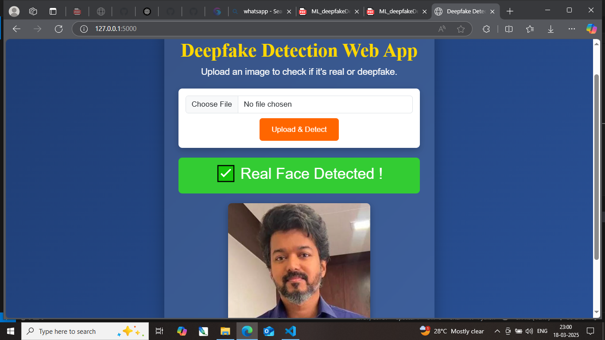

# 🧠 Deepfake Detection Web App using CNN (MobileNetV2)


---

## 💡 About the Project

This project is a user-friendly **Deepfake Detection Web Application** powered by a **CNN model (MobileNetV2)**.  
It allows users to upload an image and quickly detect whether it is a **real or deepfake image** using a trained model.

---

## 📸 Sample Output

### ✅ Real Face Detection


### ❌ Fake Face Detection


---

## 🚀 Features

- 🧠 Built with MobileNetV2 (TensorFlow & Keras)
- 🖼️ Detects fake or manipulated images in real-time
- 💻 Flask-based web interface
- 📁 Upload or test images easily
- 🎨 Clean and colorful UI

---


---

## 🧰 Tech Stack

- 🐍 Python 3
- 🔬 TensorFlow / Keras
- 🧪 OpenCV
- 🌐 Flask
- 🖥️ HTML/CSS/JS
- 🎨 Canva (UI assets)

---

## 📦 Installation & Setup

### 📥 Clone the repository

```bash
git clone https://github.com/its-bhavani/Web-app-to-detect-deepfake-images-using-CNN-MobileNetV2.git
cd Web-app-to-detect-deepfake-images-using-CNN-MobileNetV2
```

### Create Virtual Environment (Optional but Recommended)
```bash
    python -m venv venv
    venv\Scripts\activate   # Windows
```

### 📦 Install Required Packages
```bash
    pip install -r requirements.txt
```

### ▶️ Run the Web App
```bash
    python app.py
```

